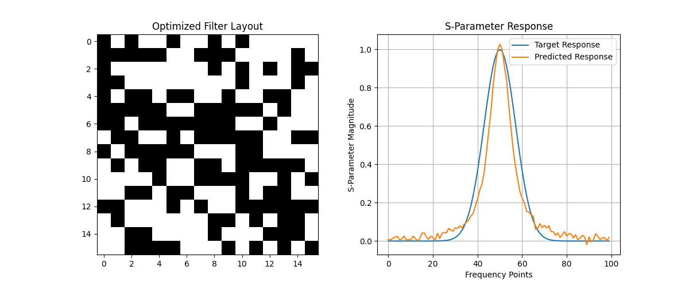

# Generative AI for Radio Filter Design

This project is an attempt to implement and explore some of the core ideas presented in the Nature article: **[Deep-learning enabled generalized inverse design of multi-port radio-frequency and sub-terahertz passives and integrated circuits](https://doi.org/10.1038/s41467-024-54178-1)**.

The goal is to build a simplified, PyTorch-based framework that uses a generative/optimization process to design radio filters, demonstrating the potential of AI in complex engineering design.

**Disclaimer:** This is a simplified implementation for educational purposes. It uses a synthetic dataset and does not rely on a real-world electromagnetic (EM) simulator like the one in the paper. The results are therefore illustrative of the process, not of real-world filter performance.

## Project Overview

The core of this project is a two-stage process that mimics the methodology described in the paper:

1.  **Electromagnetic (EM) Emulator:** A Convolutional Neural Network (CNN) is trained to act as a fast surrogate for a traditional EM simulator. It takes a 2D pixelated image of a filter layout and predicts its frequency response (S-parameters). This avoids the computationally expensive physics simulations required by conventional design methods.

2.  **Inverse Design Optimizer:** A Genetic Algorithm (GA) uses the trained EM Emulator to perform inverse design. It starts with a desired target frequency response and evolves a population of filter layouts over many generations until it finds a design whose predicted response matches the target.

## Project Structure

```
RLFilters/
├── .gitignore
├── README.md
├── requirements.txt
├── data/
│   └── synthetic_data.csv  (Generated)
├── models/
│   └── em_emulator.pth     (Generated)
└── src/
    ├── data_generator.py   # Generates synthetic training data
    ├── dataset.py          # PyTorch Dataset for loading data
    ├── model.py            # CNN architecture for the EM Emulator
    ├── train.py            # Script to train the EM Emulator
    └── optimizer.py        # Implements the Genetic Algorithm for inverse design
```

## Getting Started

### Prerequisites

- Python 3.x
- The libraries listed in `requirements.txt`.

### Installation

1.  **Clone the repository:**
    ```bash
    git clone <your-repo-url>
    cd RLFilters
    ```

2.  **Install dependencies:**
    ```bash
    pip install -r requirements.txt
    ```
    *Note: This project was developed with `numpy<2`. If you encounter compatibility issues with `torch`, you may need to manage the numpy version accordingly.*

    *Also, to run the scripts from the root directory, you may need to add the project directory to your `PYTHONPATH`.*
    ```bash
    export PYTHONPATH=$PYTHONPATH:/path/to/your/RLFilters
    ```

### Running the Project

The project is designed to be run in three sequential steps:

**Step 1: Generate Synthetic Data**

First, run the data generator to create the training set for the emulator.

```bash
python src/data_generator.py
```
This will create `data/synthetic_data.csv`.

**Step 2: Train the EM Emulator**

Next, train the CNN model on the generated data.

```bash
python src/train.py
```
This will train the model and save the weights to `models/em_emulator.pth`.

**Step 3: Run the Inverse Design Optimizer**

Finally, run the genetic algorithm to find a filter layout that matches a target frequency response.

```bash
python src/optimizer.py
```
This will start the optimization process and, upon completion, display a plot of the best-found filter layout and its predicted frequency response.



## Future Work

This foundational implementation could be extended in many ways:

-   **Integrate a Real EM Simulator:** Replace the synthetic data generator with a script that calls a real (or open-source) EM simulator to generate high-fidelity training data.
-   **More Complex Architectures:** Experiment with more advanced CNN architectures (e.g., ResNets, U-Nets) for the emulator.
-   **Advanced Optimization:** Explore other optimization algorithms like Particle Swarm Optimization (PSO), or generative models like Variational Autoencoders (VAEs) or Generative Adversarial Networks (GANs).
-   **Multi-Port Devices:** Extend the framework to handle multi-port devices, as discussed in the paper, which would require designing a more complex output from the emulator.

## Citation

The work in this repository is inspired by the following publication:

> Karahan, E. A., Liu, Z., Gupta, A., Shao, Z., Zhou, J., Khankhoje, U., & Sengupta, K. (2024). Deep-learning enabled generalized inverse design of multi-port radio-frequency and sub-terahertz passives and integrated circuits. *Nature Communications*, *15*(1), 10734. https://doi.org/10.1038/s41467-024-54178-1